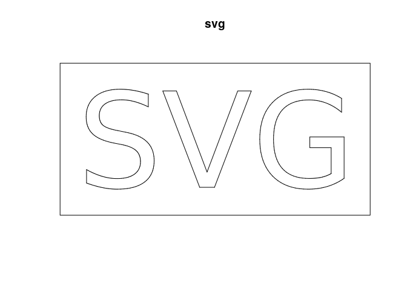
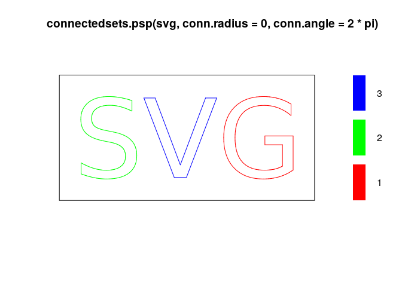

svg2psp
=======

The package provides functions to import SVG files into a spatstat R object.

The main function is `svg2psp` and the only obligatory parameter is the path of the SVG file to import. The function only import SVG *paths* and understand absolute and relative SVG commands `moveto`, `lineto`, and `curveto` (quadratic and cubic bezier curves).

``` r
library(svg2psp)
filepath = system.file("extdata","SVG.svg", package = "svg2psp")
svg = svg2psp(file=filepath,bezier = 10)
svg
#> planar line segment pattern: 417 line segments
#> window: rectangle = [0, 118.9211] x [0, 58.42246] mm
```

Imported data can be vizualised using spatstat functions.

``` r
plot(svg)
```



Quadratic bezier curves are approximated to cubic bezier curves. Cubic bezier curves are approximated by the De Casteljau algorithm. The number of iterations used for the approximation are passed using the `bezier` parameter.

``` r
svg_low = svg2psp(file=filepath,bezier = 1)
svg_low
#> planar line segment pattern: 57 line segments
#> window: rectangle = [0, 118.9211] x [0, 58.42246] mm
plot(svg_low)
```


By default, `svg2psp` assumes that the origin of coordinates is at the bottom left of the image. The parameter `reverse` can be use to flip the vertical coordinate so as to have the origin at the top left of the image, similarly to TIFF images. If the SVG contains size information, `svg2psp` also uses these informations to build the psp object (dimensions and units). The `rescale` parameter can be used to obtain a `psp` object in pixel coordinates.

``` r
svg2 = svg2psp(file=filepath,bezier = 10,reverse=F, rescale=F)
svg2
#> planar line segment pattern: 417 line segments
#> window: rectangle = [0, 421.374] x [0, 207.00872] units
plot(svg2)
```

 The other function parameters are detailed in the `help(svg2psp)` help page.

The `svg2psp` package also provides 2 functions to manipulate the psp objects:

The `cut` method cut the segments of the `psp` object to smaller segments of size `maxlength`. Each segments is cut into *n* smaller segments of length `maxlength` plus a remainding segment of length &lt; `maxlength`.

``` r
cut(svg,1) # Note the number of line segments.
#> planar line segment pattern: 745 line segments
#> window: rectangle = [0, 118.9211] x [0, 58.42246] mm
```

The `connectedsets.psp` function automatically define sets of segments based on their proximity and the angles they form. Two segments which have one end less or equal to `conn.radius` units apart and form and angle less or equal to `conn.angle` radian will be considered to belong to the same set.

``` r
plot(connectedsets.psp(svg,conn.radius=0,conn.angle=2*pi))
```



Installation
------------

You can install svg2psp from github with:

``` r
# install.packages("devtools")
devtools::install_github("xraynaud/svg2psp")
```
